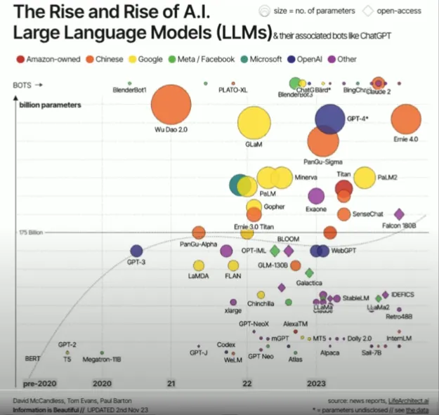

# iAnanab

SLM and MVP interface for AI things. This project is because I don't really understand how any of this works and so the best way, I find, for myself to figure it out - is to make my own project in it. It may get completed, it might not, depending on motivation, interest and my ability or inability to grasp these concepts. Feel free to contribute, fork, or tell me to pound sand. I'm not really bothered.

## Tiny Language Model

##### Summary

tiny_banan is a tiny language model... I'm not sure I love how SLM's/LLM's work though, and so it might be different than a traditional language model, but as I learn how to build these - it might be that I find I'm "reinventing" the wheel and coming to the same conclusions that other language models have come to. It might just be that I become a grammar police... we'll see.

###### Problem

I found the above image from this [medium article](https://medium.com/@shravankoninti/build-a-small-language-model-slm-from-scratch-3ddd13fa6470 "A "), and so the problem that I would like to see about solving is the quantity of parameters required, and creating a language model that doesn't necessarily require quite so many parameters in order to comprehend and respond. Can I make a language learning model that runs locally with less intensive use of hardware by leveraging language from a more linguistic approach?

## Idea

###### AKA Rambling incoherent thoughts that eventually might or might not form a complete theory.

This is the part where I show that I am maybe an idiot just not comprehending the subject matter. But, the theory is that there is possibly a simpler way to do all of this without needing billions of parameters. The goal being more like millions - and just having a more robust set of definitions and algorithmic rules to be more efficient and effective. Right now this section is a work in progress as I really define my "theory" (alternatively termed: brain dead ideological whimsy) - Is the current meta of generative/agentic AI and LLM's sucked into a sunk cost fallacy (credit to my ex wife for this being drilled into my head over the years).

##### Alternative Language Models

I'm going to preface this by stating what will become painfully obvious - I am not a linguist, and anyone that ever speaks with me would never accuse me of being truly fluent in the one language that is my native tongue. I do have some basic comprehension of some other languages (Norwegian, and Spanish) but no one would ever accuse me of being truly fluent in those either. So the idea that I'm testing with this is sort of why...

In linguistics there are 5 domains of language.

1. [Phonology ](https://en.wikipedia.org/wiki/Phonology)- Rules governing structure, distribution and sequencing of speech sounds.
2. [Morphology ](<https://en.wikipedia.org/wiki/Morphology_(linguistics)>)- Study of the smallest units of meaning (morphemes), such as root words and suffixes.
3. [Syntax ](https://en.wikipedia.org/wiki/Syntax)- Rules governing word order; forming phrases, clauses, and sentinces.
4. [Semantics ](https://en.wikipedia.org/wiki/Semantics)- Rules governing meaning and context of words or grammatical units.
5. [Pragmatics ](https://en.wikipedia.org/wiki/Pragmatics)- Rules that govern language use in social context and conversational interactions.

The 5 components are often grouped into three major domains:

1. Form: (how sounds and words are arranged) - Phonology, Morphology, and Syntax
2. Content: (the meaning of the language) - Semantics
3. Use: (how language is used in context) - Pragmatics

In an LLM the lexicon, as it were, seems to be composed of so many words that it is clearly bloated to the point that it is taking up inordinate amounts of resources ie. DDR5 ram costs exceeding prices of GPU's. Can this be simplified using a more human style approach to designing, or is this just a mathematical exercise in proving the current meta to be the right direction?

> From [Wikipedia](https://en.wikipedia.org/wiki/Linguistics)
>
> ### Lexicon
>
> The lexicon is a catalogue of words and terms that are stored in a speaker's mind. The lexicon consists of words and [bound morphemes](https://en.wikipedia.org/wiki/Bound_morphemes "Bound morphemes"), which are parts of words that can not stand alone, like [affixes](https://en.wikipedia.org/wiki/Affixes "Affixes").
> In some analyses, compound words and certain classes of idiomatic
> expressions and other collocations are also considered to be part of the
> lexicon. Dictionaries represent attempts at listing, in alphabetical
> order, the lexicon of a given language; usually, however, bound
> morphemes are not included. [Lexicography](https://en.wikipedia.org/wiki/Lexicography "Lexicography"),
> closely linked with the domain of semantics, is the science of mapping
> the words into an encyclopedia or a dictionary. The creation and
> addition of new words (into the lexicon) is called coining or [neologization](https://en.wikipedia.org/wiki/Neologization "Neologization"),^[[34]](https://en.wikipedia.org/wiki/Linguistics#cite_note-34)^ and the new words are called [neologisms](https://en.wikipedia.org/wiki/Neologism "Neologism").
>
> It is often believed that a speaker's capacity for language lies
> in the quantity of words stored in the lexicon. However, this is often
> considered a myth by linguists. The capacity for the use of language is
> considered by many linguists to lie primarily in the domain of grammar,
> and to be linked with [competence](https://en.wikipedia.org/wiki/Linguistic_competence "Linguistic competence"),
> rather than with the growth of vocabulary. Even a very small lexicon is
> theoretically capable of producing an infinite number of sentences.
>
> [Vocabulary](https://en.wikipedia.org/wiki/Vocabulary "Vocabulary")
> size is relevant as a measure of comprehension. There is general
> consensus that reading comprehension of a written text in English
> requires 98% coverage, meaning that the person understands 98% of the
> words in the text.^[[35]](https://en.wikipedia.org/wiki/Linguistics#cite_note-35)^
> The question of how much vocabulary is needed is therefore related to
> which texts or conversations need to be understood. A common estimate is
> 6-7,000 [word families](https://en.wikipedia.org/wiki/Word_family "Word family") to understand a wide range of conversations and 8-9,000 word families to be able to read a wide range of written texts.^[[36]](https://en.wikipedia.org/wiki/Linguistics#cite_note-36)^

Other considerations: [Style](https://en.wikipedia.org/wiki/Stylistics)

### Design

Following the basic rules of linguistics can we create a Tiny Language Model and system that is overall simpler and less cumbersome?

For an MVP solution I think we'd have a few sub-sections, I'm not going to initially worry about sounds and style as this model will just be text based. Probably just a command line or simple desktop/web app that can take input and provide output.

#### - The language model:

- Phonology - probably be ignored here for the mvp
- Morphology - Dataset of bare english words and suffixes
- Syntax - Rule set for word order; forming phrases, clauses and sentences
- Semantics - Dataset of English words and their definitions
- Pragmatics - Rules governing interpretation of language use.

I want to try and leverage the concept of lexicons and the theory behind them to see if a different form of organization could be utilized to increase responsiveness and decrease hardware requirements, providing better scaling and even better learning.

## Iterations/Implementation

### MVP

- CLI tool that takes user input in plain English and can parse it and return a response
- LCM - Language Comprehension Model that implements lexicons in comprehension/formulating responses, has a local store dataset it utilizes to form coherent responses.

### V1 - MVP

- Presentation - Crossplatform access - desktop/web/cli
- LCM
- Code agent - python, go
- API
